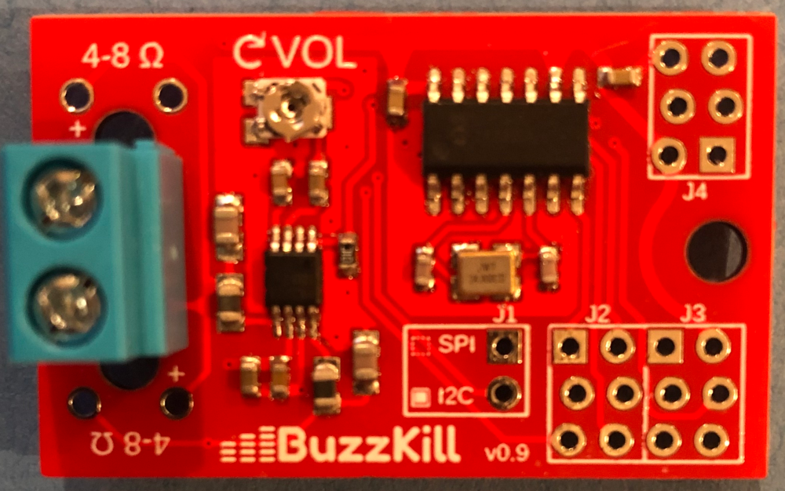
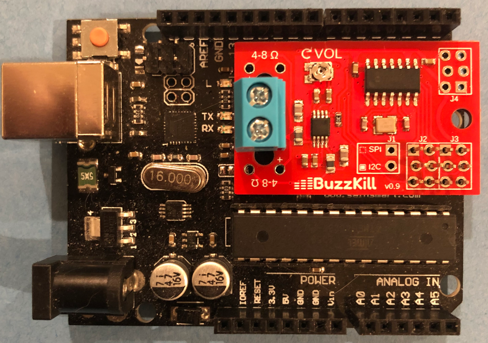

# BuzzKill Sound Effects Board

|||
|:---:|:---:|
|*Stand-Alone BuzzKill Board*|*BuzzKill Mounted on Arduino Uno*|

## Description

BuzzKill is an open-source sound effects generator board. It can create complex sounds, play music, and even emulate human speech.

Please note: this is not an audio playback board. Although it can easily be used to play pre-made sounds, it operates by dynamically creating sounds according to specified parameters. If you are looking for a board that stores audio files or plays .WAV or .MP3 files, this is not the board for you.

BuzzKill is most useful as a peripheral for a microcontroller. Using either an I2C or SPI interface, a controller can send commands to produce an infinite variety of sounds. Essentially, BuzzKill acts as a compact musical instrument producing sounds on demand. It contains a full-featured additive synthesizer, capable of emulating an assortment of instrument sounds or creating totally new ones.

BuzzKill contains:

* 4 audible oscillators
* 4 modulation oscillators
* 7 pre-defined waveforms
* Custom waveform for arbitrary shapes
* 4 ADSR envelope generators
* Patch system for dynamically-changing sounds
* A rudimentary speech synthesizer
* Built-in amplifier with direct speaker outputs

## Quick Demos

|Short Demo Medley|Detailed Prototype Intro|More Prototype Details|
|-----------------|------------------------|----------------------|
||||

## Easy to Connect

BuzzKill can interact with virtually any controlling device using either an SPI or I2C interface. It can even mount directly onto many Arduino models, with no soldering required.

## Low-Cost Design

BuzzKill is designed to be extremely cost-effective, with a cost only slight higher than a simple amplifier board would be. Total cost of parts (PCB and components) should be less than $10 USD, even in single quantities. Of course this doesn't include certain general supplies and tooling, most importantly an AVR-compatible UPDI programmer.

If we are able to partner with an open-source hardware manufacturer/supplier, we may be able to make a fully-assembled version available for $10 or less!

## Documentation

* [Hardware Guide](documentation/BuzzKill_hardware_guide.pdf) -- Quick guide for proper hardware connections
* [User Guide](documentation/BuzzKill_user_guide.pdf) -- Detailed guide to complete operations

## Construction

Constructing a BuzzKill board for yourself consists of three phases:
* __Fabricating the PCB__. You can upload the provided [Gerber files](hardware/BuzzKill_gerber_files.zip) to any number of board fabrication houses.
* __Assembling the PCB__. The board is fairly simple to reflow solder with no special equipment.
* __Flashing the firmware__. You can directly use the provided [binary](firmware/BuzzKill_firmware.hex) file or assemble your own from source.

For more details, please read the [Hardware Notes](hardware#hardware-notes) and [Firmware Notes](firmware#firmware-notes).

## License

Copyright (c) 2025 Todd E. Stidham

Shared under MIT license.
See LICENSE for additional details.
